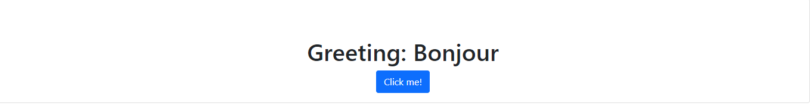
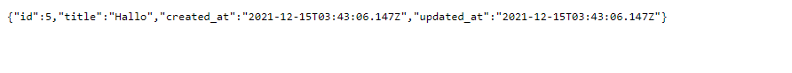

# Set up a "Hello world" project with rails-react gem

- In this project I implemented a connection between a Ruby on Rails back-end and React front-end.


## Built With

- Ruby v2.6.6
- Ruby on Rails v6.1.4.3
- React
- Redux
- sqlite3
- PostgreSQL
- Rubocop

## Linters

- Rubocop
- Stylelint


## Images
## 
## 

## Getting Started

To get a local copy up and running follow these simple example steps.


### Setup


```
$ npm install
$ bundle install
```

Setup database with:

```
$ rails db:create
$ rails db:migrate
$ rails db:seed
```

### Usage

Start server with:

```
rails server
```

Open `http://localhost:3000/` in your browser.
Open `http://localhost:3000/greeting` in your browser to see a random greeting from the table.


## API Endpoints

> List a random greeting from my table

```http://127.0.0.1:3000/v1/greetings```

## 


## Author

## 👩‍💻 Rocio Martinez
- Github: [@Rocio01](https://github.com/Rocio01)
- Twitter: [@rugiada8801](https://twitter.com/rugiada8801)
- Linkedin: [zulma-rocio-martinez](https://www.linkedin.com/in/zulma-rocio-martinez)


## 🤝 Contributing

Contributions, issues and feature requests are welcome!

Feel free to check the [issues page](https://github.com/Rocio01/hello-rails-react/issues).

## Show your support

Give a ⭐️ if you like this project!
